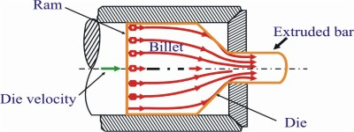
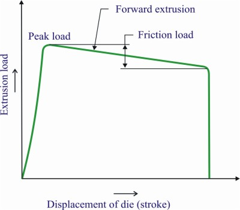
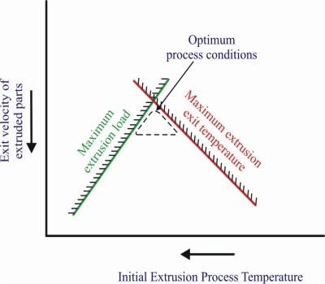
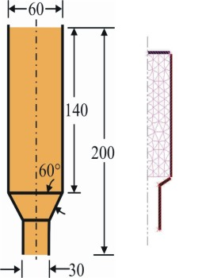
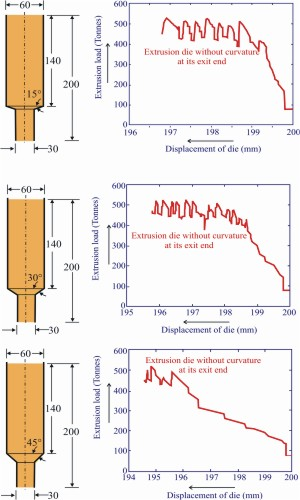
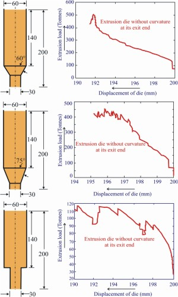

### Extrusion process

Hot extrusion is a metal forming process of forcing a heated billet to be reduced in its cross section by forcing it to flow through a shaped die opening under a high pressure. During extrusion metal billet is under compression stress state in all three direction and shear forces, figure 1. No tensile force is produced, which makes high deformation possible without tearing the metal. The hot extrusion is the widely used due to its relative low deformation resistance of the metal for production of long straight metal products of constant cross section (such as bars, solid and hollow sections, tubes, wires and strips) from materials that can not be formed by cold extrusion. Hot extrusion is an attractive process in industry due to its ability to achieve energy and material savings, quality improvement and development of homogeneous properties throughout the component. In spite of these advantages the process is rather complicate as it requires careful control. In the industrial application of the extrusion process, die design and process control are mainly based on empirical knowledge. This empirical knowledge is not well documented and is to a large extent only accessible through the experience of die designers, die correctors and press operators. Because of this the performance of the extrusion process is mainly determined by the subjective influences of these people.

In hot extrusion process a preheated billet is loaded into the container and ram presses this billet through a die, producing a profile with a cross-section determined by the shape of the die orifice. Solid profiles are generally produced with a die that consists of only one part (at die). Hollow profiles are produced with a porthole die, which consists of two parts, a mandrel to define the inner geometry of the profile and a die plate which defines the outer geometry. Principal parameters for the hot extrusion are: the extrusion ratio, the working temperature, the speed of deformation, the frictional conditions and lubrication. The extrusion ratio is the ratio of the initial cross-sectional area (A0) of the billet to the final cross-sectional area (A1) after extrusion, R = A0/A1. This is actually another name for elongation. For temperature selection, the two factors that's need to be considered are the temperature at which hot shortness occurs, or, for pure metals, the melting point, temperature rise due to heat generation during metal deformation and friction. This temperature rise is affected by the extrusion ratio, speed, etc., Heat transfer at billet-tooling interface and heat conduction within the billet and the tooling. Increasing the ram speed produces a tendency to increase the extrusion pressure; on another hand, however, low extrusion speeds leads to greater cooling of the billet and thus a tendency to increase the extrusion pressure. The higher the temperature of the billet, the greater the effect of low extrusion speed on the cooling of the billet it has. Therefore, high extrusion speeds are required with materials (e.g., high strength alloys) that need high extrusion temperatures.

In extrusion, optimization of process conditions is focused on achieving the maximum extrusion speed, for which the quality requirements imposed on the product are still satisfied.
The extrusion process is limited by two factors, the maximum extrusion load and the maximum exit temperature, figures 2 and 3. The maximum extrusion load is either imposed by the strength of the die or by the maximum capacity of the extrusion press. The extrusion load can be lowered by increasing the initial temperature of the billet. However, this is limited by the maximum exit temperature of the material. When this temperature gets too high, surface defects or even melting of the material can occur. So basically optimization of the process comes down to choosing an optimum initial temperature. In the design of extrusion dies, a major challenge is to obtain a uniform exit velocity over the entire cross-section of the profile. The objective of FE simulations here is to reduce the problems encountered in extrusion practice. In simulation of extrusion viscoplastic model is used and elasticity of the material is neglected. The reason for this is that the elastic deformations are small compared to the very large plastic deformations that occur during the process. A number of extrusion defects need to be avoided. During extrusion, the center of the billet moves faster than the periphery. After about two-thirds of the billet is extruded, the outer surface of the billet, which was formed as dead zone in the early extrusion stage, moves towards the centre and extrudes through the die near the axis of the rod.
  
Since the surface of the billet often contains an oxidized skin, this type of flow results in internal oxide stringers or internal pipes. With higher friction, and the higher temperature difference between the billet and extrusion container, the tendency for formation of the extrusion defect grows higher. The reason is that they promote faster metal flow in the center part of the billet than in the surface skin. Other defects include axial hole (or called funnel), surface cracking, center burst etc. Axial hole is caused by radial metal flow into the die when extrusion is carried to the point at which the length of billet remaining in the container is about one-quarter its diameter. Surface cracking can be produced by longitudinal tensile stresses generated as the extrusion passes through the die. Center burst, or chevron cracking, can occur at low extrusion ratios. One common problem exists in the variation in structure and properties from front to back end of the extrusion in both the longitudinal and transverse directions. Extrusion die geometry, frictional conditions at the die billet interface and thermal gradients within the greatly influence metal flow in extrusion. The only recourse for modelling this process is to consider FE simulations in obtaining such knowledge, providing insight into the process that cannot easily be obtained in any other way. The influence of the various process parameters at the die-billet interface on the geometrical accuracy of the extruded part has been investigated for the extrusion process using a finite element analysis. High values of frictional coefficient produced greater from errors in the extruded component due to the greater compressive stresses at the contact surfaces of the die. Geometrical characteristics of the extrusion die influence both the extrusion process and mechanical property of the extruded material. 

The geometry is axi-symmetric in nature so only one half of the part is simulated, figure 4. 
    
Figure 5: Dies with different inclination angle w.r.t. horizontal with their corresponding extrusion load curve w.r.t. displacement of the upper die.
## Seamless Pipe:
Seamless (Steel Pipe) is made from a solid round steel billet which is heated and pushed or pulled over a form until the steel is shaped into a hollow tube. The seamless pipe is then finished to dimensional and wall thickness specifications in sizes from 1/8 inch to 26 inch. 

## Uses:-

1. Domestic water systems.
2. Pipelines transporting gas or liquid over long distances.
3. Scaffolding
4. Structural steel
5. As components in mechanical systems such as:
   - Rollers in conveyor belts
   - Compactors (E.g.: steam rollers)
   - Bearing casing
6. The petroleum industry:
   - Oil well casing
   - Oil refinery equipment
   
